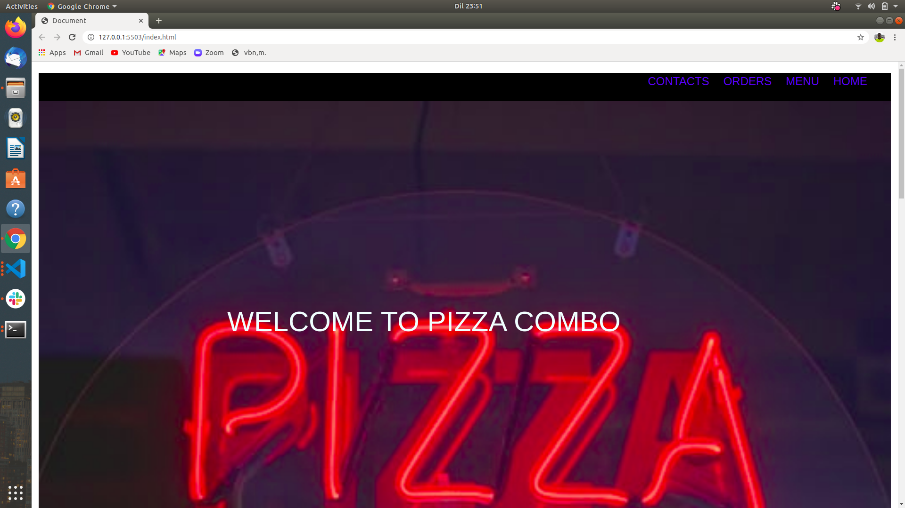

# PIZZA COMBO APPLICATION

This is an app that enables customers to buy pizzas online from the comfort of their devices.

## DESCRIPTION

-The user is able to see the landing page from where he/she  accesses the menu and the place to order

-The user can then order and decide how to get the order.

-If the order is to be delivered the delivery location of the buyer is also required.

### A SCREENSHOT OF THE PROJECT.

### HOW TO GET STARTED
-Copy the link on the green button written code.

-On the terminal:

-`git clone https://github.com/EmmanuelWanzala/PizzaCombo.git`

-`cd PizzaCombo`

-Type `code .` or `atom .` depending on your text editor

### THE LIVE LINK TO THE PIZZA COMBO APPLICATION

### AUTHOR
-[Wanzala Emmanuel John](https://emmanuelwanzala.github.io/portfolio/)

### LICENSE

MIT License

Copyright (c) [2020] [Emmanuel John Wanzala]

Permission is hereby granted, free of charge, to any person obtaining a copy
of this software and associated documentation files (the "Software"), to deal
in the Software without restriction, including without limitation the rights
to use, copy, modify, merge, publish, distribute, sublicense, and/or sell
copies of the Software, and to permit persons to whom the Software is
furnished to do so, subject to the following conditions:

The above copyright notice and this permission notice shall be included in all
copies or substantial portions of the Software.

THE SOFTWARE IS PROVIDED "AS IS", WITHOUT WARRANTY OF ANY KIND, EXPRESS OR
IMPLIED, INCLUDING BUT NOT LIMITED TO THE WARRANTIES OF MERCHANTABILITY,
FITNESS FOR A PARTICULAR PURPOSE AND NONINFRINGEMENT. IN NO EVENT SHALL THE
AUTHORS OR COPYRIGHT HOLDERS BE LIABLE FOR ANY CLAIM, DAMAGES OR OTHER
LIABILITY, WHETHER IN AN ACTION OF CONTRACT, TORT OR OTHERWISE, ARISING FROM,
OUT OF OR IN CONNECTION WITH THE SOFTWARE OR THE USE OR OTHER DEALINGS IN THE
SOFTWARE.